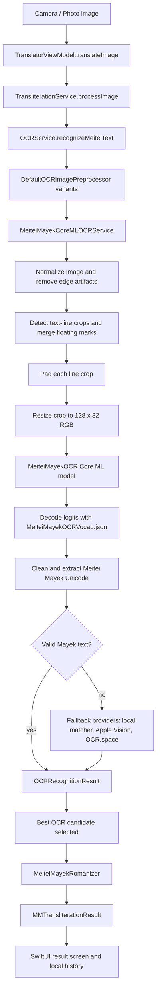

# Meitei Mayek Transliterator

Meitei Mayek Translator is a SwiftUI iOS app for transliterating between Meitei Mayek script and English/Roman spelling. It supports typed text, camera/photo-library image input, OCR-assisted script extraction, result sharing, speech playback, and lightweight local history.

The app focuses on transliteration and pronunciation-style Roman output. It does not perform semantic Manipuri/Meitei-to-English translation; it converts script forms into readable Roman letters and can convert Romanized input back into Meitei Mayek.

## What the Project Does

- Scans Meitei Mayek text from camera images or selected photos.
- Extracts Meitei Mayek Unicode text using a trained Core ML OCR model first.
- Falls back to local visual matching, Apple Vision, and OCR.space when the trained model cannot produce usable Meitei Mayek output.
- Cleans, ranks, and validates OCR candidates before transliteration.
- Converts Meitei Mayek script to English/Roman transliteration using local rule-based logic.
- Converts English/Romanized input to Meitei Mayek using a reference phoneme table.
- Shows OCR source, confidence score, original script, and transliterated output.
- Lets users copy, speak, and share transliteration results.
- Saves recent Meitei Mayek-to-English transliterations in local history using `UserDefaults`.

## Technology Stack

- **Language**: Swift
- **UI framework**: SwiftUI
- **Architecture pattern**: MVVM with service-oriented OCR/transliteration logic
- **Concurrency**: Swift async/await for OCR and transliteration workflows
- **Image input**: UIKit `UIImagePickerController` and PhotosUI `PHPickerViewController`
- **OCR model runtime**: Core ML `MLModel`
- **Trained OCR model**: Exported ViTSTR-style NE-OCR model from `MWirelabs/ne-ocr`
- **OCR fallbacks**:
  - Local Meitei Mayek glyph/word/line matching
  - Apple Vision `VNRecognizeTextRequest`
  - OCR.space cloud OCR
- **Image preparation**: Core Image and Core Graphics preprocessing for orientation normalization, enhancement, binarization, text-region cropping, line segmentation, edge-artifact cleanup, and OCR model resizing
- **Speech**: AVFoundation `AVSpeechSynthesizer`
- **Persistence**: `UserDefaults` with Codable translation records
- **Testing**: XCTest and Swift Testing-compatible test definitions
- **Project system**: Xcode project (`.xcodeproj`)

## Current Architecture

The app follows a simple MVVM/service architecture:

```text
SwiftUI Views
    |
    v
TranslatorViewModel
    |
    v
TransliterationService
    |
    +-- OCRService
    |   +-- DefaultOCRImagePreprocessor
    |   +-- MeiteiMayekCoreMLOCRService
    |   |   +-- MeiteiMayekOCR.mlpackage / mlmodelc
    |   |   +-- MeiteiMayekOCRVocab.json
    |   +-- LocalMayekGlyphRecognizer
    |   +-- VisionOCRService
    |   +-- OCRSpaceService
    |
    +-- MeiteiMayekRomanizer
    +-- MeiteiMayekReferenceForwardTransliterator
    +-- MeiteiTextUtilities
```

## OCR to Transliteration Flow



After OCR extracts Meitei Mayek characters, the app does not directly display raw model text as the final answer. The extracted script is wrapped in `OCRRecognitionResult`, ranked by `OCRService`, passed to `TransliterationService`, and finally romanized by `MeiteiMayekRomanizer`.

## Core ML OCR Model

The primary Meitei Mayek OCR path is now `MeiteiMayekCoreMLOCRService`.

### Model Assets

| Asset | Purpose |
| --- | --- |
| `MeiteiMayekTranslator/Models/MeiteiMayekOCR.mlpackage` | Exported Core ML model used by the app. Xcode compiles this into `MeiteiMayekOCR.mlmodelc` in the app bundle. |
| `MeiteiMayekTranslator/Models/MeiteiMayekOCRVocab.json` | Vocabulary used by the Swift decoder to convert model logits into Unicode text. |
| `Scripts/export_ne_ocr_coreml.py` | Reproducibly exports the Hugging Face/PyTorch model to Core ML. |
| `Scripts/test_ne_ocr.py` | Smoke-tests the original PyTorch model on a word/line crop. |
| `Scripts/test_ne_ocr_coreml.py` | Smoke-tests the generated Core ML model on a word/line crop. |

### Model Input and Output

- Input name: `image`
- Input shape: `[1, 3, 32, 128]`
- Input format: RGB, channels-first, normalized `Float32` values in `0...1`
- Output name: `logits`
- Output shape: `[1, 33, 1056]`
- Decoder: argmax per timestep, stop at `<eos>`, map indexes through `MeiteiMayekOCRVocab.json`

The model is loaded with `MLModelConfiguration.computeUnits = .cpuOnly`. The compressed Core ML package ran correctly on CPU-only inference during verification, while the default Metal path crashed locally for this model package.

### Runtime OCR Steps

`MeiteiMayekCoreMLOCRService` performs these steps before the transliteration engine sees any text:

1. Normalize the `UIImage` orientation.
2. Render a grayscale analysis image.
3. Compute an adaptive dark-pixel threshold.
4. Remove full-height/full-width edge artifacts such as screenshot borders.
5. Detect horizontal text-line ranges using dark-pixel projection.
6. Merge nearby ranges so floating vowel marks stay attached to their base line.
7. Crop each line and add padding so edge characters are not clipped.
8. Resize each line crop to `128 x 32`.
9. Run `MeiteiMayekOCR.mlmodelc` or the bundled `.mlpackage`.
10. Decode logits into Unicode text.
11. Extract only Meitei Mayek Unicode scalars.
12. Apply known OCR corrections for model-specific misses.
13. Return structured `OCRRecognitionResult` blocks to `OCRService`.

### Known OCR Corrections

The current trained model drops the terminal `ꯥ` for some weekday words even in the original PyTorch model, so the app applies a small correction table after model decoding:

| Model output | Corrected output |
| --- | --- |
| `ꯅꯤꯡꯊꯧꯀꯥꯕ` | `ꯅꯤꯡꯊꯧꯀꯥꯕꯥ` |
| `ꯂꯩꯕꯥꯛꯄꯣꯛꯄ` | `ꯂꯩꯕꯥꯛꯄꯣꯛꯄꯥ` |

This correction is intentionally narrow. It should not replace a broader OCR model improvement; it only fixes verified model misses from the current scanned weekday images.

### Exporting the Model

The model export script downloads `MWirelabs/ne-ocr`, wraps the model to return raw logits, converts it to an iOS 16+ Core ML `mlprogram`, and applies int8 weight compression so the package remains under GitHub's normal per-file limit.

```sh
.venv-ocr/bin/python Scripts/export_ne_ocr_coreml.py
```

Useful options:

```sh
.venv-ocr/bin/python Scripts/export_ne_ocr_coreml.py --compression none
.venv-ocr/bin/python Scripts/export_ne_ocr_coreml.py --compression int8
.venv-ocr/bin/python Scripts/export_ne_ocr_coreml.py --compression palette4
```

The default is `--compression int8`.

### Testing the Model

Test the original PyTorch model:

```sh
.venv-ocr/bin/python Scripts/test_ne_ocr.py /path/to/line-or-word-crop.png
```

Test the exported Core ML model:

```sh
.venv-ocr/bin/python Scripts/test_ne_ocr_coreml.py /path/to/line-or-word-crop.png
```

Known smoke-test output for `Meetei_Mayek.png`:

```text
ꯃꯤꯇꯩ ꯃꯌꯦꯛ
```

Known local probe output for `IMG_7970.jpg` after the border/line-crop fixes:

```text
ꯅꯤꯡꯊꯧꯀꯥꯕꯥ
ꯂꯩꯕꯥꯛꯄꯣꯛꯄꯥ
```

## OCR Provider Order

`OCRService` tries providers in this order:

1. `MeiteiMayekCoreMLOCRService` (`Meitei Core ML`)
2. `VisionOCRService` (`Apple Vision`)
3. `OCRSpaceService` (`OCR.space`)

The Core ML model is the primary OCR path for Meitei Mayek. Apple Vision and OCR.space are still useful for diagnostics and fallback, but Apple Vision does not currently provide reliable native Meitei Mayek OCR by itself.

## Source File Responsibilities

### App Entry and Navigation

| File | Responsibility |
| --- | --- |
| `App/MeiteiMayekTranslatorApp.swift` | App entry point. Creates the main `WindowGroup` and loads `ContentView`. |
| `Views/ContentView.swift` | Root tab interface. Hosts the Scan and History tabs and injects `TranslatorViewModel` into the environment. |

### UI Layer

| File | Responsibility |
| --- | --- |
| `Views/ScanView.swift` | Main UI for scanning, selecting photos, typing input, switching transliteration mode, and displaying inline results. Also contains UIKit/PhotosUI picker wrappers and `TextInputView`. |
| `Views/ResultView.swift` | Detailed result screen for completed Meitei Mayek-to-English transliteration. Shows source image, detected script, confidence, OCR source, Roman transliteration, copy/share/speak actions, and navigation actions. |
| `Views/HistoryView.swift` | History tab. Displays saved translation records, empty states, delete actions, and clear-all confirmation. |

### View Model

| File | Responsibility |
| --- | --- |
| `ViewModels/TranslatorViewModel.swift` | Main observable state container. Tracks loading/error/result state, selected image, typed input, mode, forward output, history, and speech synthesis. Coordinates calls into `TransliterationService`, persists history, and exposes UI helper values like confidence text/color. |

### OCR and Transliteration Services

| File | Responsibility |
| --- | --- |
| `Services/Transliteration/TransliterationService.swift` | Transliteration-facing service layer. It asks `OCRService` for extracted Meitei Mayek text, validates script content, builds `MMTransliterationResult`, and exposes typed-text transliteration in both directions. Also contains local visual fallback matchers. |
| `Services/OCR/OCRService.swift` | OCR orchestration layer. Runs image variants through the provider chain, ranks candidates by Meitei Mayek content and confidence, rejects low-confidence blocks, and preserves reading order. |
| `Domain/Models/OCRModels.swift` | Shared OCR protocols and structured models such as `OCRRecognitionResult`, `OCRTextBlock`, `OCRTextCandidate`, and `OCRImageVariant`. |
| `Services/OCR/OCRImagePreprocessor.swift` | Image preparation pipeline. Normalizes orientation, upscales small text, creates enhanced and binarized variants, crops dark text regions, and avoids lossy compression before OCR providers run. |
| `Services/OCR/MeiteiMayekCoreMLOCRService.swift` | Primary trained-model OCR engine. Segments image lines, removes edge artifacts, runs the Core ML model, decodes logits with the model vocabulary, extracts Meitei Mayek Unicode, and falls back when needed. |
| `Utilities/MeiteiMayekTextCleaner.swift` | Meitei Mayek-specific text cleaner. Keeps valid `U+ABC0-U+ABFF` and `U+AAE0-U+AAFF` Unicode scalars, preserves line breaks, strips OCR wrappers/noise, and avoids unsafe character replacement. |
| `Services/OCR/OCRDebugLogger.swift` | Debug helper. When `OCRDebugEnabled` is set in `UserDefaults` on a debug build, writes OCR image variants to the temporary directory and logs raw/cleaned OCR output. |
| `Services/OCR/OCRSpaceService.swift` | Cloud OCR adapter. Compresses images, submits them to OCR.space, decodes responses, retries on timeout with smaller image data, and reports OCR errors. |
| `Services/OCR/VisionOCRService.swift` | On-device OCR adapter using Apple Vision text recognition. It uses accurate mode, disables language correction, passes image orientation, captures top candidates, and sorts text blocks by reading order. |
| `Services/Transliteration/MeiteiMayekRomanizer.swift` | Small adapter that converts Meitei Mayek text to Roman/English spelling through `MeiteiMayekReferenceReverseTransliterator`. |

### Reference Transliteration Engine

| File | Responsibility |
| --- | --- |
| `Services/Transliteration/MeiteiMayekReferencePhonemes.swift` | Reference phoneme table for vowels, consonants, lonsum letters, digits, and apun mayek combinations. |
| `Services/Transliteration/MeiteiMayekReferenceTransliterator.swift` | Bidirectional rule engine. `MeiteiMayekReferenceForwardTransliterator` converts English/Roman input to Meitei Mayek, while `MeiteiMayekReferenceReverseTransliterator` tokenizes Meitei Mayek and converts it back to Roman output. |
| `Services/Transliteration/MeiteiMayekEnglishFormatter.swift` | Normalizes raw romanization into display-friendly English spelling, including whitespace cleanup, simple spelling normalization, and title-casing for display output. |
| `Utilities/MeiteiTextUtilities.swift` | Text helper methods for Meitei Mayek Unicode detection, Mayek character counting, Mayek ratio scoring, OCR cleanup, Mayek-only extraction, and English transliteration validation. |
| `Domain/Models/ScriptDetector.swift` | Detects whether text contains Meitei Mayek, Bengali, or unknown script based on Unicode scalar ranges. |

### Models and Compatibility

| File | Responsibility |
| --- | --- |
| `Domain/Models/TransliterationResult.swift` | Defines `MMTransliterationResult`, the main result model used by the UI and service layer. Includes script text, Roman transliteration, confidence, OCR source, engine name, timestamp, and UI convenience accessors. |
| `Domain/Models/TranslationRecord.swift` | Defines the Codable history model saved to `UserDefaults`. Also includes compatibility aliases and backward-compatible decoding for older result field names. |
| `Domain/Models/TransliterationResult+Compat.swift` | Deprecated compatibility placeholder. Compatibility has moved into the core model. |

### Tests and Scripts

| File | Responsibility |
| --- | --- |
| `MeiteiMayekTranslatorTests/TransliterationPipelineTests.swift` | Tests script detection, Mayek ratio calculation, OCR-noise extraction, local transliteration service behavior, image OCR fixtures, and English transliteration validation. |
| `MeiteiMayekTranslatorTests/RomanizerTests.swift` | Tests romanizer behavior, digits, whitespace, zero-width joiners, names, demo sentences, and round-trip behavior against the reference forward transliterator. |
| `MeiteiMayekTranslatorTests/MeiteiMayekTranslatorTests.swift` | Default XCTest placeholder/performance test file. |
| `MeiteiMayekTranslatorUITests/*` | Default UI launch and launch performance test files. |
| `Scripts/export_ne_ocr_coreml.py` | Exports and compresses the trained NE-OCR model to Core ML. |
| `Scripts/test_ne_ocr.py` | Runs PyTorch OCR inference against a crop. |
| `Scripts/test_ne_ocr_coreml.py` | Runs Core ML OCR inference against a crop. |

## Data Models

### `MMTransliterationResult`

Represents a transliteration result shown in the UI:

- `detectedScript`: Meitei Mayek text used as input.
- `englishTransliteration`: Roman/English spelling output.
- `confidence`: Confidence score derived from OCR source and Mayek-character ratio.
- `ocrSource`: Source of recognized text, such as `Meitei Core ML`, `OCR.space`, `Apple Vision`, or `typed`.
- `transliterationEngine`: Current engine label, usually `On-device`.
- `createdAt`: Result creation timestamp.

### `TranslationRecord`

Persisted history record created from a result. It stores the original script, Roman transliteration, confidence, OCR source, engine name, and creation date. It also decodes several legacy field names so older stored history can still load.

## Typed Input

For typed text:

- **Mayek to English**: `transliterateText(_:)` validates Meitei Mayek content and calls `MeiteiMayekRomanizer`.
- **English to Mayek**: `transliterateEnglishToMayek(_:)` calls `MeiteiMayekReferenceForwardTransliterator`.

## OCR Debugging

In a debug build, enable OCR debug output with:

```swift
UserDefaults.standard.set(true, forKey: "OCRDebugEnabled")
```

When enabled, `OCRDebugLogger` writes original and preprocessed images under the app's temporary `MeiteiMayekOCR` directory and logs raw OCR text, cleaned OCR text, extracted script, source, variant, and confidence.

Use this when comparing why a scan fails:

- Inspect the original image.
- Inspect enhanced, binarized, and cropped variants.
- Check whether borders or page edges are treated as text.
- Compare raw model output with cleaned/extracted Meitei Mayek.
- Confirm which provider won the ranking step.

## Project Structure

```text
MeiteiMayekTranslator/
├── MeiteiMayekTranslator/
│   ├── Models/
│   │   ├── MeiteiMayekOCR.mlpackage/
│   │   └── MeiteiMayekOCRVocab.json
│   ├── App/
│   ├── Views/
│   ├── ViewModels/
│   ├── Domain/
│   │   └── Models/
│   ├── Services/
│   │   ├── OCR/
│   │   └── Transliteration/
│   ├── Utilities/
│   └── Assets.xcassets/
├── MeiteiMayekTranslatorTests/
├── MeiteiMayekTranslatorUITests/
├── Scripts/
├── MeiteiMayekTranslator.xcodeproj/
└── README.md
```

## Running the App

1. Open `MeiteiMayekTranslator.xcodeproj` in Xcode.
2. Select the `MeiteiMayekTranslator` scheme.
3. Choose an iOS simulator or a physical device.
4. Build and run.

Camera scanning requires a device or simulator environment that supports camera input. Photo-library selection and typed transliteration can be tested without camera hardware.

## Running Tests

From Xcode, select the test target or press `Command+U`.

From the command line, use an available simulator destination:

```sh
xcodebuild test \
  -project MeiteiMayekTranslator.xcodeproj \
  -scheme MeiteiMayekTranslator \
  -destination 'platform=iOS Simulator,name=iPhone 16'
```

If the named simulator is not installed, run `xcrun simctl list devices` and choose an available simulator name.

Recent local verification used `iPhone 17` because `iPhone 16` was not available on the machine:

```sh
env DEVELOPER_DIR=/Applications/Xcode.app/Contents/Developer xcodebuild test \
  -project MeiteiMayekTranslator.xcodeproj \
  -scheme MeiteiMayekTranslator \
  -destination 'platform=iOS Simulator,name=iPhone 17' \
  -derivedDataPath /private/tmp/MeiteiMayekTranslatorDerivedData
```

## Configuration Notes

- The app target currently includes a camera usage description in generated Info.plist settings.
- The project is configured as an Xcode project with app, unit test, and UI test targets.
- The current project file shows Swift 5 settings and an iOS deployment target of 26.5.
- `OCRSpaceService` currently contains an OCR.space API key directly in source. For production use, move this key to a safer configuration mechanism instead of committing it in code.
- `.venv-ocr/` is local developer tooling for model export/testing and is ignored by Git.

## Current Limitations

- OCR quality still depends on image clarity, crop quality, font style, lighting, blur, and background artifacts.
- The app performs transliteration, not meaning-based translation.
- OCR.space requires network access, while Core ML and Apple Vision run on device.
- Apple Vision does not currently provide reliable native Meitei Mayek OCR, so it is treated as a fallback/diagnostic provider rather than the main OCR engine.
- The trained model is strongest on printed word/line crops. Very long lines, handwriting, decorative fonts, extreme blur, or heavy perspective distortion may need a larger fine-tuned dataset.
- A small post-OCR correction table exists for verified terminal-vowel misses. This should grow only from tested failures, not guessed replacements.
- History is intentionally lightweight and stored locally in `UserDefaults`.
- Some UI test files are still default generated placeholders.

## Production OCR Roadmap

The current Core ML model is a practical step forward, but stronger production OCR should continue along this path:

1. Collect printed and handwritten Meitei Mayek images across fonts, sizes, scan qualities, lighting, blur, and backgrounds.
2. Label each word, line, character, and common cluster with exact Unicode output.
3. Add a layout detector for pages, lines, words, and characters.
4. Fine-tune a recognition model specifically for Meitei Mayek and the app's real camera conditions.
5. Export the model to Core ML and compare PyTorch vs Core ML output on the same fixtures.
6. Keep Apple Vision and OCR.space as fallback/diagnostic providers.
7. Add regression fixtures for every real-world OCR failure before expanding corrections.

## Purpose

This project helps users read, learn, preserve, and work with Meitei Mayek by making script conversion more accessible through typed input, camera/photo OCR, and local rule-based transliteration.
