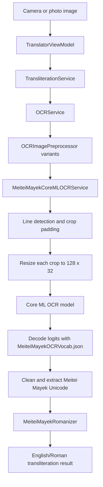

# Meitei Mayek Translator Study Plan

This guide is a hands-on path for learning the project from image scanning through Meitei Mayek OCR and Roman transliteration. It is written for this repository's current architecture, model export script, Core ML runtime, and rule-based transliteration engine.

Default pace: four weeks, 60 to 90 minutes per day.

## Learning Goals

By the end of this plan, you should be able to:

- Explain the complete flow from scanned image to English/Roman output.
- Identify the boundary between OCR extraction and transliteration.
- Re-export the Hugging Face/PyTorch OCR model into a Core ML `.mlpackage`.
- Explain why the Core ML model consumes `128 x 32` line crops.
- Debug whether a bad result came from preprocessing, model prediction, decoding, cleanup, or transliteration.
- Add a new OCR regression image and verify the expected Meitei Mayek Unicode output.

## Project Flow



## Week 1: Architecture and App Flow

Focus: understand how the SwiftUI app is organized and how one user action travels through MVVM into the service layer.

Study these areas:

- `MeiteiMayekTranslator/App`: app entry point.
- `MeiteiMayekTranslator/Views`: scan, result, and history screens.
- `MeiteiMayekTranslator/ViewModels`: user action and UI state coordination.
- `MeiteiMayekTranslator/Services`: OCR and transliteration business logic.
- `MeiteiMayekTranslator/Domain/Models`: OCR, script, history, and transliteration models.
- `MeiteiMayekTranslator/Utilities`: script cleanup and Unicode helpers.

Trace this flow:

1. The user selects or scans an image.
2. `TranslatorViewModel` receives the image and starts translation.
3. `TransliterationService` asks `OCRService` to extract script text.
4. OCR returns Meitei Mayek Unicode text with source and confidence metadata.
5. `TransliterationService` sends the extracted script into `MeiteiMayekRomanizer`.
6. The result screen displays original script, Roman output, OCR source, and confidence.

Hands-on exercise:

- Pick one image fixture or a downloaded scan.
- Write down every class/file touched from button tap to final result.
- Recreate the project flow diagram by memory after reading the code.

Checkpoint:

- You can describe what the view model owns versus what the service layer owns.
- You can explain why OCR and transliteration are separate responsibilities.

## Week 2: OCR Pipeline in Swift

Focus: understand how the app turns an arbitrary user image into model-ready line crops.

Study the local OCR path first:

- Orientation normalization.
- Grayscale rendering.
- Adaptive thresholding.
- Edge and border artifact cleanup.
- Horizontal projection-based line detection.
- Floating mark merging so vowel marks stay with their base text line.
- Crop padding to avoid clipped characters.
- Resize to `128 x 32`.
- Convert pixels into a channels-first `MLMultiArray` shaped `[1, 3, 32, 128]`.

Study Core ML inference:

- How `MeiteiMayekOCR.mlpackage` or compiled `MeiteiMayekOCR.mlmodelc` is loaded.
- How `MeiteiMayekOCRVocab.json` is loaded.
- How the `logits` output is decoded by timestep.
- How `<eos>` stops decoding.
- How confidence is estimated.
- How model-specific known corrections are applied after decoding.

Hands-on exercise:

- Enable OCR debug output in a debug build:

```swift
UserDefaults.standard.set(true, forKey: "OCRDebugEnabled")
```

- Run one clear image through the app.
- Inspect the original, enhanced, binarized, cropped, and model input images.
- Compare the crop the model sees with the final extracted text.

Checkpoint:

- You can explain why image preprocessing is often the real OCR bottleneck.
- You can tell whether a failure is caused by bad line cropping or bad model recognition.

## Week 3: Hugging Face/PyTorch to Core ML Export

Focus: learn how the trained OCR model becomes an iOS-consumable `.mlpackage`.

Study the export script:

- `Scripts/export_ne_ocr_coreml.py`

The script performs these steps:

1. Downloads `ne_ocr_best.pt` from Hugging Face repo `MWirelabs/ne-ocr`.
2. Downloads `ne_ocr_vocab.json` from the same repo.
3. Loads the vocabulary and removes the first special token for the Doctr model vocabulary string.
4. Builds `vitstr_base(pretrained=False, vocab=vocab)`.
5. Loads the PyTorch `state_dict`.
6. Wraps the model in `ViTSTRLogitsWrapper`.
7. Traces the wrapper using a dummy input shaped `[1, 3, 32, 128]`.
8. Converts traced TorchScript to Core ML `mlprogram`.
9. Sets iOS 16 as the minimum deployment target.
10. Uses float16 compute precision.
11. Optionally compresses weights with int8 or 4-bit palette compression.
12. Saves the `.mlpackage` and matching vocabulary JSON into `MeiteiMayekTranslator/Models`.

Why the wrapper exists:

- The original PyTorch model can return Python-side decoded predictions.
- Core ML needs a stable tensor interface.
- The Swift app needs raw `logits` so it can decode using the bundled vocabulary.
- Returning logits keeps PyTorch and Swift decoding comparable and debuggable.

Run the export:

```sh
.venv-ocr/bin/python Scripts/export_ne_ocr_coreml.py
```

Useful variants:

```sh
.venv-ocr/bin/python Scripts/export_ne_ocr_coreml.py --compression none
.venv-ocr/bin/python Scripts/export_ne_ocr_coreml.py --compression int8
.venv-ocr/bin/python Scripts/export_ne_ocr_coreml.py --compression palette4
```

Hands-on exercise:

- Re-run the export with the default int8 compression.
- Confirm that `MeiteiMayekTranslator/Models/MeiteiMayekOCR.mlpackage` exists.
- Confirm that `MeiteiMayekTranslator/Models/MeiteiMayekOCRVocab.json` exists.
- Run the PyTorch and Core ML smoke scripts on the same line crop and compare the output.

Checkpoint:

- You can explain what `torch.jit.trace` captures.
- You can explain why the app saves the vocabulary JSON beside the model.
- You can explain why model output is `[1, sequence, classes]` logits instead of a string.

## Week 4: Transliteration and End-to-End Debugging

Focus: understand what happens after OCR successfully extracts Meitei Mayek Unicode.

Study cleanup:

- How OCR output is filtered to Meitei Mayek Unicode ranges.
- How non-Meitei noise is rejected.
- How line breaks and whitespace are normalized.
- How low-confidence OCR candidates are ranked or discarded.

Study transliteration:

- `MeiteiMayekRomanizer`
- `MeiteiMayekReferenceReverseTransliterator`
- `MeiteiMayekReferenceForwardTransliterator`
- `MeiteiMayekReferencePhonemes`
- `MeiteiMayekEnglishFormatter`

Follow this distinction carefully:

- OCR answers: "What Meitei Mayek characters are visible in this image?"
- Transliteration answers: "How should this Meitei Mayek text be represented in English/Roman letters?"

Study fallback behavior:

1. `MeiteiMayekCoreMLOCRService` is the primary Meitei Mayek OCR engine.
2. Apple Vision is a diagnostic fallback.
3. OCR.space is a network fallback.
4. Candidate ranking prefers more Meitei Mayek characters, better Mayek ratio, stronger confidence, and useful length.

Capstone exercise:

- Use a known test image such as `Meetei_Mayek.png` or `IMG_7970.jpg`.
- Document the full journey:
  - original image
  - preprocessed variant
  - detected line crop
  - model input shape
  - decoded Meitei Mayek text
  - cleaned Meitei Mayek text
  - Roman transliteration output
  - mismatch analysis, if any

Checkpoint:

- You can tell whether a wrong English/Roman output came from bad OCR or bad transliteration.
- You can create a small regression note for a failed scan with expected Unicode text.

## Practical Debugging Checklist

Use this order when a scanned image gives a wrong result:

1. Confirm whether the image contains clean, visible Meitei Mayek text.
2. Check whether the detected crop contains the full word or line.
3. Check whether floating marks were cropped away.
4. Compare PyTorch output and Core ML output on the same crop.
5. Inspect decoded Unicode before text cleanup.
6. Inspect cleaned Unicode before transliteration.
7. Test the cleaned Unicode as typed input.
8. If typed input transliterates correctly, the issue is OCR-side.
9. If typed input transliterates incorrectly, the issue is transliteration-side.

## Suggested Study Artifacts

Create these notes while studying:

- `architecture-notes.md`: MVVM and service responsibilities.
- `ocr-debug-notes.md`: image preprocessing observations and failed scan notes.
- `model-export-notes.md`: PyTorch to Core ML export explanation in your own words.
- `transliteration-notes.md`: Unicode-to-Roman mapping observations.
- `capstone-trace.md`: one full image-to-English walkthrough.

These can stay as personal notes and do not need to be committed unless they become useful project documentation.

## Final Self-Test

You are ready to work confidently in this project when you can answer these without reading the README:

- What is the difference between OCR and transliteration in this app?
- Which class primarily owns the trained Meitei Mayek OCR model?
- Why does the app resize line crops to `128 x 32`?
- Why does Swift decode logits instead of receiving a model-decoded string?
- What file exports the Hugging Face/PyTorch model to Core ML?
- What file maps model indexes back to Unicode characters?
- What should you inspect first when only half a scanned line is extracted?
- How can you prove whether a wrong result is OCR-side or transliteration-side?
